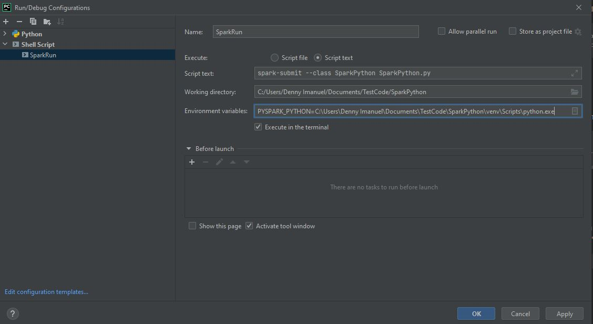

# Spark Python
by Denny Imanuel

This mini project showcase how to build and debug Apache Spark application using Python programming language.
There are also options to run Spark application on Spark container

## Spark on Localhost

### Requirement

1. PyCharm IDE - You need to install PyCharm IDE
2. Java JDK - You need to install Java JDK and set JAVA_HOME env
3. Python - You need to install Python and set PYTHONPATH env
4. [Spark Hadoop](https://archive.apache.org/dist/spark/spark-3.1.2/spark-3.1.2-bin-hadoop3.2.tgz) - You need to install Spark Hadoop and set HADOOP_HOME and SPARK_HOME env

For more info: https://dotnet.microsoft.com/en-us/learn/data/spark-tutorial/install-spark

### Run Config

To run Spark app run Spark Submit command or create a new 'Run Config' under Shell Script as follows:

    set PYSPARK_PYTHON "<clone_dir>\SparkPython\venv\Scripts\python.exe"
    spark-submit --class SparkPython SparkPython.py

### Build Config

To build Spark app run Spark Submit command or create a new 'Build Config' under Python Debug Server as follows:

    venv\Scripts\activate
    pip install pydevd-pycharm~=<pycharm_ver> 

### Debug Config

To debug Spark app create 'Debug Config' using standard Python configuration file and then insert following code. 
In order to debug run above 'Build Config' first, set breakpoint, and then run this 'Debug Config':

    import pydevd_pycharm
    pydevd_pycharm.settrace('localhost', port=8888, stdoutToServer=True, stderrToServer=True)

## Spark on Docker

### Requirement

1. Rider IDE / Visual Studio - You need to install Rider IDE or Visual Studio
2. Docker Desktop - You need to install Docker Desktop to run Docker
3. Spark Image - Make sure you pull same version of Spark image as your local Spark:

>docker pull bitnami/spark:3.1.2

### Spark Clusters

Docker Compose below will run Spark cluster in master and worker node. First comment the debug line(6,7) and then
pack the venv folder into venv.tar.gz and then submit both SparkPython.py file and venv.tar.gz to Spark cluster.

    docker-compose up
    spark-submit --master spark://localhost:7070 --class SparkPython SparkPython.py --archives venv.tar.gz

### Output Result

If the Spark application is successfully build it should print out result table as follows:

    

